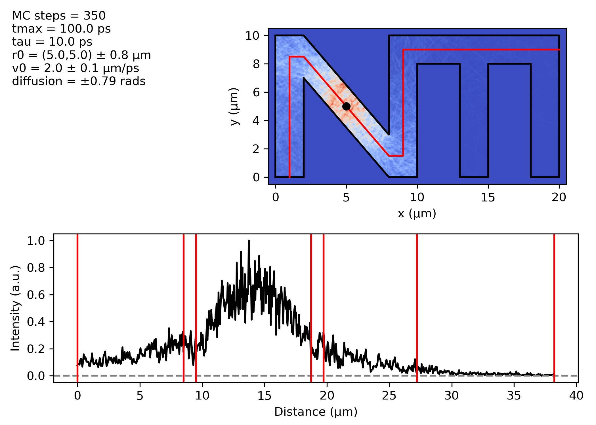

# 2D ballistic transport

This is a simple `python 3.x` tool to calculate the ballistic diffusion of a set of particles in 2 dimensions. The user specify a polygonal domain where the particles move. The interaction with the edges can be adjusted from perfectly elastic to completly random. The code computes the time evolution of all particles and prints out the heatmap of the trajectories. Also, the code computes the (normalized) profile of how many times all particles have visited a given cutline over the domain.

## Installation

Just download the package repository or simply copy/paste the `bt.py` file.

Requirements:

- `python 3.x`
- `numpy`
- `matplotlib`
- `tqdm`

## Usage

The user must first create an input file in `json` format. 
Then, to exectute the calculation, simply type in the terminal

`python bt.py <my-input-file>`

Input files can be of two types: **scratch** and **restart**. Examples are given in

- [`input_from_scratch.txt`](https://github.com/t3n0/ballistic-transport/blob/master/input_from_scratch.txt),
- and [`input_restart.txt`](https://github.com/t3n0/ballistic-transport/blob/master/input_restart_.txt).

Description of the `json` (key, value) pairs:

- `"start"`   : `str`, either "from_scratch" or "restart"
- `"flag"`    : `str`, name of the destination directory
- `"MC"`      : `[int]`, list of Monte Carlo points (particles) per each run
- `"tau"`     : `[float]`, list of lifetimes per each run
- `"tmax"`    : `[float]`, list of maximum propagation time per each run
- `"r0mean"`  : `[[float, float]]`, list of initial positions of the partciles per each run
- `"r0var"`   : `[float]`, list of variances of the particle initial position per each run
- `"v0mean"`  : `[float]`, list of initial velocities of the partciles per each run
- `"v0var"`   : `[float]`, list of variances of the particle initial velocity per each run
- `"phi"`     : `[float]`, list of diffusion angles in unit of pi (0.0 is perfect elestic, 1.0 is complete random) per each run
- `"samples"` : `[int, int]`, x and y steps for the domain discretisation
- `"points"`  : `[[float, float]]`, list of vertices of the closed polygon defining the domain
- `"section"` : `[[float, float]]`, list of vertices of the broken line defining the cutlines over the domain

The entries `MC`, `tau`, `tmax`, `r0mean`, `r0var`, `v0mean`, `v0var`, `phi` must have the same length (the total number of individual runs).

In a restart calculation, only `start`, `flag` and `MC` are required.

## Output

The program creates a new folder named as the `flag` keyword specified in the `json` input file. Data and images are named in progressive order and are the collected in

- `<flag>/data`
- `<flag>/images`

Data are saved in the `numpy` `npz` format, images are saved as `png` files.

## Support

For any problems, questions or suggestions, please contact me at tenobaldi@gmail.com.

## Authors and acknowledgment

The development of SWCNT is proudly powered by [me](https://github.com/t3n0).

## License

This program is free software: you can redistribute it and/or modify it under the terms of the GNU General Public License as published by the Free Software Foundation, either version 3 of the License, or (at your option) any later version.

This program is distributed in the hope that it will be useful, but WITHOUT ANY WARRANTY; without even the implied warranty of MERCHANTABILITY or FITNESS FOR A PARTICULAR PURPOSE.  See the GNU General Public License for more details.

You should have received a copy of the GNU General Public License along with this program.  If not, see <https://www.gnu.org/licenses/>.
